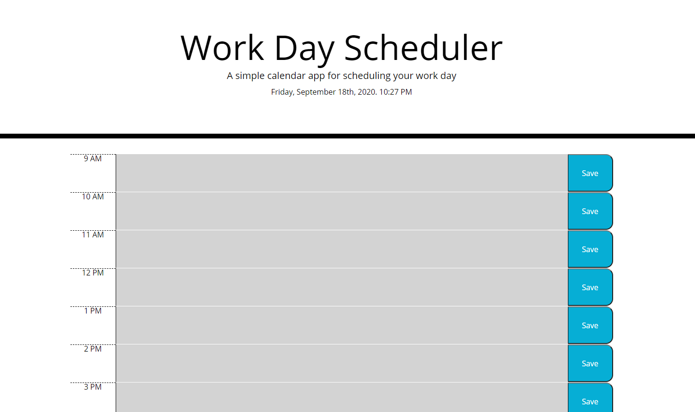
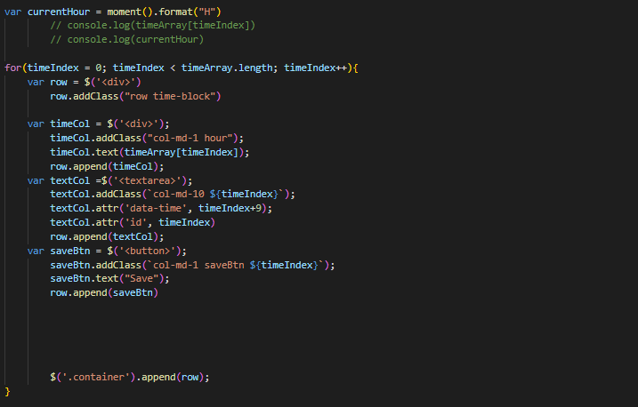

# Day-Planner

I wanted to see if I could make an app that can take in user input information and save it localy in the browser. Also made for a good excuse to push my jQuery skills. I'm quite comofrtable with building sites with html and css so pushing myeslf to make dynamically created rows and elements was a lot of fun. 

## The Code

Using jquery to dynamically create and iderate on the differnet times of the day on this assignment was an interesting challenge. Being able to make a limetless amount of elements with just a few lines of code was quite an eye opener. Then realizing I could use API's to interact with that code to dynamically add different classes to the code durring different times of day. I want to keep pushing this type of element generation for future projects. I know I need to push my understanding of local storage but getting this to work was so rewarding. Over time I want to come back and refactor this code to make the logging of data dryer. 